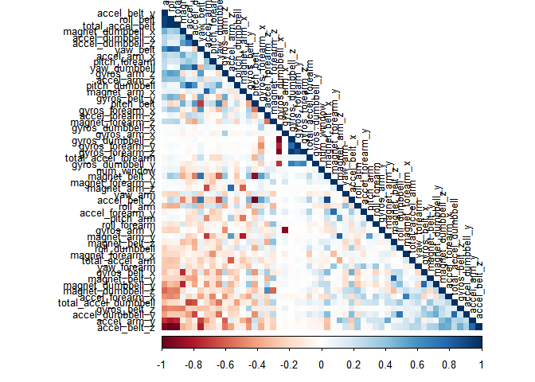
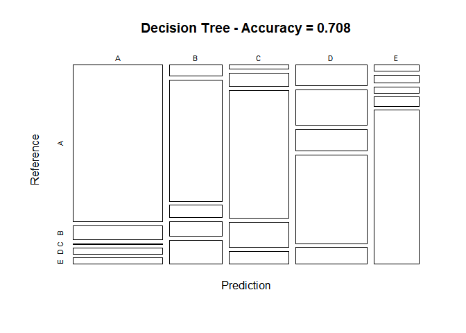
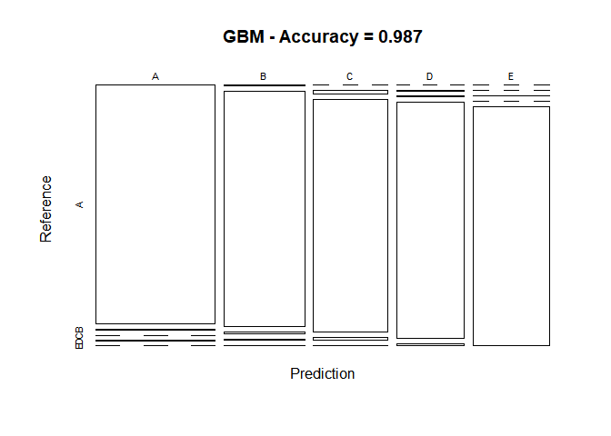

#Practical machine Learning Project: Prediction Assignment Writeup

##Overview
###This document is the final project of the Peer Assessment project from Coursera’s course Practical Machine Learning, as part of the Specialization in Data Science. It was built up in RStudio, using its knitr functions, meant to be published in html format.
###This analysis meant to be the basis for the course quiz and a prediction assignment writeup. The main goal of the project is to predict the manner in which 6 participants performed some exercise as described below. This is the “class” variable in the training set. The machine learning algorithm described here is applied to the 20 test cases available in the test data and the predictions are submitted in appropriate format to the Course Project Prediction Quiz for automated grading.

##Background
###Using devices such as Jawbone Up, Nike FuelBand, and Fitbit it is now possible to collect a large amount of data about personal activity relatively inexpensively. These type of devices are part of the quantified self movement - a group of enthusiasts who take measurements about themselves regularly to improve their health, to find patterns in their behavior, or because they are tech geeks. One thing that people regularly do is quantify how much of a particular activity they do, but they rarely quantify how well they do it. In this project, your goal will be to use data from accelerometers on the belt, forearm, arm, and dumbell of 6 participants. They were asked to perform barbell lifts correctly and incorrectly in 5 different ways. More information is available from the website here: http://groupware.les.inf.puc-rio.br/har (see the section on the Weight Lifting Exercise Dataset).

##Library Import

```r
library(knitr)
library(lattice)
library(ggplot2)
library(caret)
library(rpart)
library(rpart.plot)
library(rattle)
```

```
## Rattle: A free graphical interface for data science with R.
## Version 5.2.0 Copyright (c) 2006-2018 Togaware Pty Ltd.
## Type 'rattle()' to shake, rattle, and roll your data.
```

```r
library(randomForest)
```

```
## randomForest 4.6-14
```

```
## Type rfNews() to see new features/changes/bug fixes.
```

```
## 
## Attaching package: 'randomForest'
```

```
## The following object is masked from 'package:rattle':
## 
##     importance
```

```
## The following object is masked from 'package:ggplot2':
## 
##     margin
```

```r
library(corrplot)
```

```
## corrplot 0.84 loaded
```

##Data Loading and Exploratory Analysis

```r
# set the URL for the download
UrlTrain <- "http://d396qusza40orc.cloudfront.net/predmachlearn/pml-training.csv"
UrlTest  <- "http://d396qusza40orc.cloudfront.net/predmachlearn/pml-testing.csv"

# download the datasets
training <- read.csv(url(UrlTrain))
testing  <- read.csv(url(UrlTest))

# create a partition with the training dataset 
inTrain  <- createDataPartition(training$classe, p=0.7, list=FALSE)
TrainSet <- training[inTrain, ]
TestSet  <- training[-inTrain, ]
dim(TrainSet)
```

```
## [1] 13737   160
```

```r
#Checking Missing Values
colnames(TrainSet)[sapply(TrainSet,function(x) sum(is.na(x))) > 0]
```

```
##  [1] "max_roll_belt"            "max_picth_belt"          
##  [3] "min_roll_belt"            "min_pitch_belt"          
##  [5] "amplitude_roll_belt"      "amplitude_pitch_belt"    
##  [7] "var_total_accel_belt"     "avg_roll_belt"           
##  [9] "stddev_roll_belt"         "var_roll_belt"           
## [11] "avg_pitch_belt"           "stddev_pitch_belt"       
## [13] "var_pitch_belt"           "avg_yaw_belt"            
## [15] "stddev_yaw_belt"          "var_yaw_belt"            
## [17] "var_accel_arm"            "avg_roll_arm"            
## [19] "stddev_roll_arm"          "var_roll_arm"            
## [21] "avg_pitch_arm"            "stddev_pitch_arm"        
## [23] "var_pitch_arm"            "avg_yaw_arm"             
## [25] "stddev_yaw_arm"           "var_yaw_arm"             
## [27] "max_roll_arm"             "max_picth_arm"           
## [29] "max_yaw_arm"              "min_roll_arm"            
## [31] "min_pitch_arm"            "min_yaw_arm"             
## [33] "amplitude_roll_arm"       "amplitude_pitch_arm"     
## [35] "amplitude_yaw_arm"        "max_roll_dumbbell"       
## [37] "max_picth_dumbbell"       "min_roll_dumbbell"       
## [39] "min_pitch_dumbbell"       "amplitude_roll_dumbbell" 
## [41] "amplitude_pitch_dumbbell" "var_accel_dumbbell"      
## [43] "avg_roll_dumbbell"        "stddev_roll_dumbbell"    
## [45] "var_roll_dumbbell"        "avg_pitch_dumbbell"      
## [47] "stddev_pitch_dumbbell"    "var_pitch_dumbbell"      
## [49] "avg_yaw_dumbbell"         "stddev_yaw_dumbbell"     
## [51] "var_yaw_dumbbell"         "max_roll_forearm"        
## [53] "max_picth_forearm"        "min_roll_forearm"        
## [55] "min_pitch_forearm"        "amplitude_roll_forearm"  
## [57] "amplitude_pitch_forearm"  "var_accel_forearm"       
## [59] "avg_roll_forearm"         "stddev_roll_forearm"     
## [61] "var_roll_forearm"         "avg_pitch_forearm"       
## [63] "stddev_pitch_forearm"     "var_pitch_forearm"       
## [65] "avg_yaw_forearm"          "stddev_yaw_forearm"      
## [67] "var_yaw_forearm"
```

```r
#Delete these columns which have extreme low variance
#Using Near Zero Variance (NZV)
NZV <- nearZeroVar(TrainSet)
TrainSet <- TrainSet[, -NZV]
TestSet  <- TestSet[, -NZV]
dim(TrainSet)
```

```
## [1] 13737   104
```

```r
dim(TestSet)
```

```
## [1] 5885  104
```

```r
#remove variables that are mostly NA
AllNA    <- sapply(TrainSet, function(x) mean(is.na(x))) > 0.95
TrainSet <- TrainSet[, AllNA==FALSE]
TestSet  <- TestSet[, AllNA==FALSE]
dim(TrainSet)
```

```
## [1] 13737    59
```

```r
dim(TestSet)
```

```
## [1] 5885   59
```

```r
#remove identification between 1 and 5 columns
TrainSet <- TrainSet[, -(1:5)]
TestSet  <- TestSet[, -(1:5)]
dim(TrainSet)
```

```
## [1] 13737    54
```

```r
dim(TestSet)
```

```
## [1] 5885   54
```
##Correlation Analysis

```r
corMatrix = cor(TrainSet[,-54])
corrplot(corMatrix, order="FPC", method="color", type="lower",tl.cex = 0.8, tl.col = rgb(0,0,0))
```

<!-- -->
###The highly correlated variables are shown in dark colors in the graph above. To make an evem more compact analysis, a PCA (Principal Components Analysis) could be performed as pre-processing step to the datasets. Nevertheless, as the correlations are quite few, this step will not be applied for this assignment.

##Prediction Model Building
###Three methods will be applied to model the regressions (in the Train dataset) and the best one (with higher accuracy when applied to the Test dataset) will be used for the quiz predictions. The methods are: Random Forests, Decision Tree and Generalized Boosted Model, as described below.
###A Confusion Matrix is plotted at the end of each analysis to better visualize the accuracy of the models.

##Random Forest

```r
set.seed(12345)
controlRF = trainControl(method="cv", number=3, verboseIter = FALSE)
modFitRandomForest = train(classe~., data = TrainSet, method='rf',trControl=controlRF)
modFitRandomForest$finalModel
```

```
## 
## Call:
##  randomForest(x = x, y = y, mtry = param$mtry) 
##                Type of random forest: classification
##                      Number of trees: 500
## No. of variables tried at each split: 27
## 
##         OOB estimate of  error rate: 0.25%
## Confusion matrix:
##      A    B    C    D    E  class.error
## A 3904    2    0    0    0 0.0005120328
## B    6 2648    4    0    0 0.0037622272
## C    0    4 2392    0    0 0.0016694491
## D    0    0    9 2242    1 0.0044404973
## E    0    1    0    7 2517 0.0031683168
```


```r
# prediction on Test dataset
predictRandForest <- predict(modFitRandomForest, newdata=TestSet)
confMatRandForest <- confusionMatrix(predictRandForest, TestSet$classe)
confMatRandForest
```

```
## Confusion Matrix and Statistics
## 
##           Reference
## Prediction    A    B    C    D    E
##          A 1674    2    0    0    0
##          B    0 1137    3    0    0
##          C    0    0 1023    1    0
##          D    0    0    0  963    3
##          E    0    0    0    0 1079
## 
## Overall Statistics
##                                           
##                Accuracy : 0.9985          
##                  95% CI : (0.9971, 0.9993)
##     No Information Rate : 0.2845          
##     P-Value [Acc > NIR] : < 2.2e-16       
##                                           
##                   Kappa : 0.9981          
##  Mcnemar's Test P-Value : NA              
## 
## Statistics by Class:
## 
##                      Class: A Class: B Class: C Class: D Class: E
## Sensitivity            1.0000   0.9982   0.9971   0.9990   0.9972
## Specificity            0.9995   0.9994   0.9998   0.9994   1.0000
## Pos Pred Value         0.9988   0.9974   0.9990   0.9969   1.0000
## Neg Pred Value         1.0000   0.9996   0.9994   0.9998   0.9994
## Prevalence             0.2845   0.1935   0.1743   0.1638   0.1839
## Detection Rate         0.2845   0.1932   0.1738   0.1636   0.1833
## Detection Prevalence   0.2848   0.1937   0.1740   0.1641   0.1833
## Balanced Accuracy      0.9998   0.9988   0.9984   0.9992   0.9986
```

```r
# plot matrix results
plot(confMatRandForest$table, col = confMatRandForest$byClass, 
     main = paste("Random Forest - Accuracy =",
      round(confMatRandForest$overall['Accuracy'], 3)))
```

<!-- -->

##Decision Tree

```r
# model fit
set.seed(12345)
modFitDecTree <- rpart(classe ~ ., data=TrainSet, method="class")
prp(modFitDecTree)
```

<!-- -->

```r
# prediction on Test dataset
predictDecTree <- predict(modFitDecTree, newdata=TestSet, type="class")
confMatDecTree <- confusionMatrix(predictDecTree, TestSet$classe)
confMatDecTree
```

```
## Confusion Matrix and Statistics
## 
##           Reference
## Prediction    A    B    C    D    E
##          A 1414  126    5   52   56
##          B   58  643   65   77  128
##          C   25   80  772  154   77
##          D  149  255  156  639  120
##          E   28   35   28   42  701
## 
## Overall Statistics
##                                         
##                Accuracy : 0.7084        
##                  95% CI : (0.6966, 0.72)
##     No Information Rate : 0.2845        
##     P-Value [Acc > NIR] : < 2.2e-16     
##                                         
##                   Kappa : 0.6321        
##  Mcnemar's Test P-Value : < 2.2e-16     
## 
## Statistics by Class:
## 
##                      Class: A Class: B Class: C Class: D Class: E
## Sensitivity            0.8447   0.5645   0.7524   0.6629   0.6479
## Specificity            0.9432   0.9309   0.9308   0.8618   0.9723
## Pos Pred Value         0.8554   0.6622   0.6968   0.4845   0.8405
## Neg Pred Value         0.9386   0.8991   0.9468   0.9288   0.9246
## Prevalence             0.2845   0.1935   0.1743   0.1638   0.1839
## Detection Rate         0.2403   0.1093   0.1312   0.1086   0.1191
## Detection Prevalence   0.2809   0.1650   0.1883   0.2241   0.1417
## Balanced Accuracy      0.8940   0.7477   0.8416   0.7623   0.8101
```

```r
# plot matrix results
plot(confMatDecTree$table, col = confMatDecTree$byClass, 
     main = paste("Decision Tree - Accuracy =",
                  round(confMatDecTree$overall['Accuracy'], 3)))
```

<!-- -->
##Generalized Boosted Model

```r
# model fit
set.seed(12345)
controlGBM <- trainControl(method = "repeatedcv", number = 5, repeats = 1)
modFitGBM  <- train(classe ~ ., data=TrainSet, method = "gbm",
                    trControl = controlGBM, verbose = FALSE)
modFitGBM$finalModel
```

```
## A gradient boosted model with multinomial loss function.
## 150 iterations were performed.
## There were 53 predictors of which 53 had non-zero influence.
```

```r
# prediction on Test dataset
predictGBM <- predict(modFitGBM, newdata=TestSet)
confMatGBM <- confusionMatrix(predictGBM, TestSet$classe)
confMatGBM
```

```
## Confusion Matrix and Statistics
## 
##           Reference
## Prediction    A    B    C    D    E
##          A 1670    7    0    1    0
##          B    4 1115   10    5    3
##          C    0   15 1012   13    1
##          D    0    2    3  945   10
##          E    0    0    1    0 1068
## 
## Overall Statistics
##                                         
##                Accuracy : 0.9873        
##                  95% CI : (0.9841, 0.99)
##     No Information Rate : 0.2845        
##     P-Value [Acc > NIR] : < 2.2e-16     
##                                         
##                   Kappa : 0.9839        
##  Mcnemar's Test P-Value : NA            
## 
## Statistics by Class:
## 
##                      Class: A Class: B Class: C Class: D Class: E
## Sensitivity            0.9976   0.9789   0.9864   0.9803   0.9871
## Specificity            0.9981   0.9954   0.9940   0.9970   0.9998
## Pos Pred Value         0.9952   0.9807   0.9721   0.9844   0.9991
## Neg Pred Value         0.9990   0.9949   0.9971   0.9961   0.9971
## Prevalence             0.2845   0.1935   0.1743   0.1638   0.1839
## Detection Rate         0.2838   0.1895   0.1720   0.1606   0.1815
## Detection Prevalence   0.2851   0.1932   0.1769   0.1631   0.1816
## Balanced Accuracy      0.9979   0.9871   0.9902   0.9886   0.9934
```

```r
# plot matrix results
plot(confMatGBM$table, col = confMatGBM$byClass, 
     main = paste("GBM - Accuracy =", round(confMatGBM$overall['Accuracy'], 3)))
```

<!-- -->

#Test Dataset Accuracy comparison

```r
results = list(RF=confMatRandForest$overall[1], DT=confMatDecTree$overall[1], GBM=confMatGBM$overall[1])
results
```

```
## $RF
##  Accuracy 
## 0.9984707 
## 
## $DT
##  Accuracy 
## 0.7084112 
## 
## $GBM
##  Accuracy 
## 0.9872557
```
###Above the table, the Random Forest model will be applied to predict the 20 quiz results (testing dataset) as shown below.

```r
predictTEST <- predict(modFitRandomForest, newdata=testing)
predictTEST
```

```
##  [1] B A B A A E D B A A B C B A E E A B B B
## Levels: A B C D E
```


